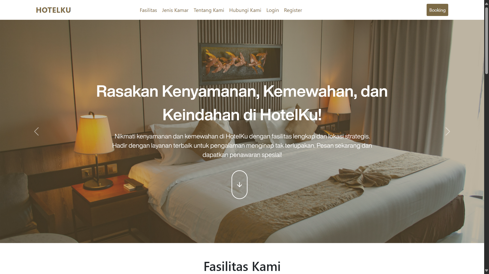
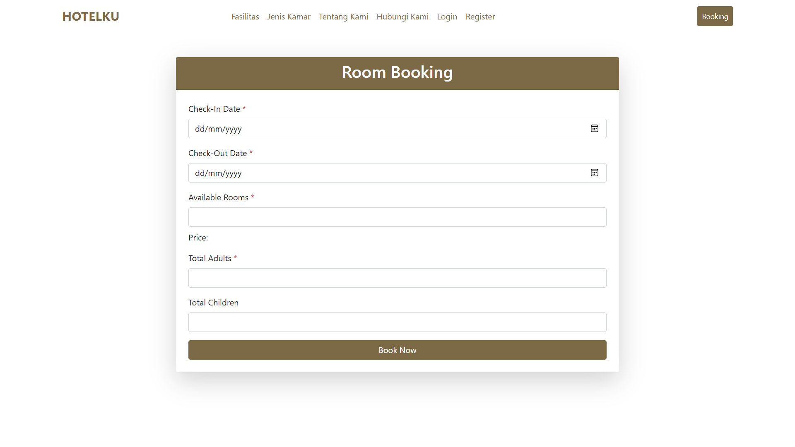
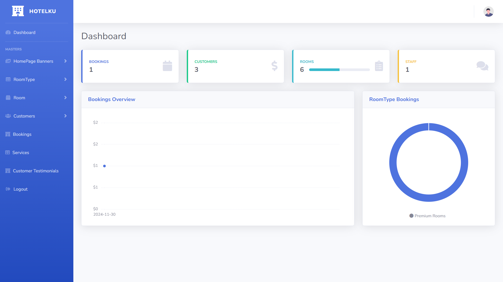
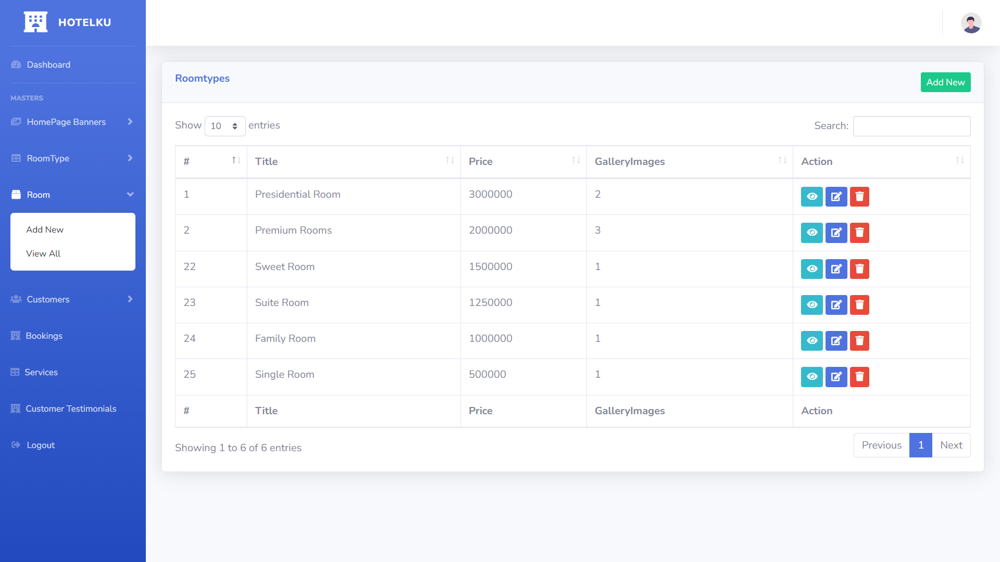

# 🏨 HotelKu - Sistem Manajemen Hotel

<div align="center">


_Sistem manajemen hotel modern dengan fitur lengkap untuk mengelola operasional hotel Anda_

</div>

---

## 📋 Daftar Isi

-   [Tentang Proyek](#-tentang-proyek)
-   [Fitur Utama](#-fitur-utama)
-   [Teknologi](#%EF%B8%8F-teknologi)
-   [Instalasi](#-instalasi)
-   [Penggunaan](#-penggunaan)
-   [Struktur Database](#-struktur-database)
-   [Screenshot](#-screenshot)
-   [Kontribusi](#-kontribusi)
-   [Lisensi](#-lisensi)

---

## 🎯 Tentang Proyek

**HotelKu** adalah sistem manajemen hotel yang dibangun dengan Laravel yang menyediakan solusi lengkap untuk mengelola operasional hotel. Sistem ini memungkinkan administrator untuk mengelola kamar, booking, customer, staff, dan berbagai aspek lainnya dalam satu platform yang terintegrasi.

### 🌟 Mengapa HotelKu?

-   **User-Friendly Interface** - Antarmuka yang intuitif dan mudah digunakan
-   **Responsive Design** - Dapat diakses dari desktop, tablet, dan mobile
-   **Secure & Reliable** - Keamanan data terjamin dengan autentikasi Laravel
-   **Modular Architecture** - Kode yang terstruktur dan mudah dikembangkan

---

## ✨ Fitur Utama

### 🏠 **Frontend (Customer)**

-   🎠 **Banner Slider** - Tampilan galeri gambar hotel yang menarik
-   🏠 **Room Gallery** - Galeri foto kamar dengan lightbox
-   🛎️ **Service Showcase** - Tampilan fasilitas dan layanan hotel
-   📝 **Online Booking** - Sistem reservasi online untuk customer
-   💬 **Testimonial** - Ulasan dan testimoni dari tamu
-   📞 **Contact Page** - Halaman kontak dan informasi hotel

### 👨‍💼 **Backend (Admin)**

-   📊 **Dashboard Analytics** - Overview statistik booking dan pendapatan
-   🏨 **Room Management** - Manajemen tipe kamar dan ketersediaan
-   📅 **Booking Management** - Kelola reservasi dan status booking
-   👥 **Customer Management** - Database customer dan riwayat booking
-   👨‍💻 **Staff Management** - Manajemen karyawan dan gaji
-   🎯 **Service Management** - Kelola fasilitas dan layanan hotel
-   🖼️ **Banner Management** - Upload dan kelola banner homepage
-   💰 **Payment Tracking** - Tracking pembayaran staff dan booking

---

## ⚙️ Teknologi

| Kategori           | Teknologi                     |
| ------------------ | ----------------------------- |
| **Backend**        | Laravel 8.x, PHP 7.4+         |
| **Frontend**       | Bootstrap 5, jQuery, Chart.js |
| **Database**       | MySQL 5.7+                    |
| **Storage**        | Laravel Storage (File Upload) |
| **Authentication** | Laravel Auth                  |
| **UI Components**  | SB Admin 2 Template           |

---

## 🚀 Instalasi

### Prasyarat

-   PHP >= 7.4
-   Composer
-   MySQL/MariaDB
-   Node.js & NPM (opsional)
-   Web Server (Apache/Nginx)

### Langkah Instalasi

1. **Clone Repository**

    ```bash
    git clone https://github.com/username/hotelku-sistem-manajemen-hotel.git
    cd hotelku-sistem-manajemen-hotel
    ```

2. **Install Dependencies**

    ```bash
    composer install
    ```

3. **Environment Setup**

    ```bash
    cp .env.example .env
    php artisan key:generate
    ```

4. **Database Configuration**

    ```env
    DB_CONNECTION=mysql
    DB_HOST=127.0.0.1
    DB_PORT=3306
    DB_DATABASE=hotelku_db
    DB_USERNAME=root
    DB_PASSWORD=
    ```

5. **Database Migration & Seeding**

    ```bash
    php artisan migrate
    php artisan db:seed
    ```

6. **Storage Symlink**

    ```bash
    php artisan storage:link
    ```

7. **Stripe Configuration (Optional)**

    Untuk mengaktifkan payment gateway Stripe:

    ```bash
    # Edit file .env dan tambahkan Stripe keys
    STRIPE_PUBLIC_KEY=pk_test_your_stripe_public_key
    STRIPE_SECRET_KEY=sk_test_your_stripe_secret_key
    ```

    📝 **Catatan**: Lihat file [`docs/STRIPE_SETUP.md`](docs/STRIPE_SETUP.md) untuk panduan lengkap setup Stripe.

8. **Run Development Server**

    ```bash
    php artisan serve
    ```

9. **Akses Aplikasi**
    - Frontend: `http://localhost:8000`
    - Admin Panel: `http://localhost:8000/admin/login`

---

## 💻 Penggunaan

### 👤 Default Admin Credentials

| Username       | Password      | Role                |
| -------------- | ------------- | ------------------- |
| **admin**      | admin123      | Administrator       |
| **superadmin** | superadmin123 | Super Administrator |
| **manager**    | manager123    | Manager             |

💡 **Tips**: Gunakan command `php artisan admin:list` untuk melihat daftar admin atau `php artisan admin:create` untuk membuat admin baru.

### 🔄 Workflow Utama

1. **Setup Initial Data**

    - Login sebagai admin
    - Upload banner untuk homepage
    - Tambahkan tipe kamar dan foto
    - Setup fasilitas/layanan hotel

2. **Customer Booking**

    - Customer browse kamar di homepage
    - Pilih tanggal dan tipe kamar
    - Isi data booking
    - Konfirmasi reservasi

3. **Admin Management**
    - Monitor booking di dashboard
    - Kelola ketersediaan kamar
    - Update status booking
    - Generate laporan

---

## 🗄️ Struktur Database

### Tabel Utama

```sql
┌─ users (Admin Authentication)
├─ customers (Customer Data)
├─ room_types (Tipe Kamar)
├─ rooms (Data Kamar)
├─ bookings (Reservasi)
├─ booked_rooms (Detail Booking)
├─ services (Fasilitas Hotel)
├─ banners (Homepage Banners)
├─ staff (Data Karyawan)
└─ staff_payments (Gaji Karyawan)
```

### Relasi Database

-   `bookings` → `customers` (one-to-many)
-   `room_types` → `rooms` (one-to-many)
-   `room_types` → `roomtypeimages` (one-to-many)
-   `bookings` → `booked_rooms` (one-to-many)

---

## 📸 Screenshot

### Frontend


_Homepage dengan banner slider dan gallery kamar_


_Form booking online untuk customer_

### Backend


_Dashboard admin dengan analytics_


_Manajemen kamar dan tipe kamar_

---

## 🔧 Fitur Tambahan

### 🎨 **UI/UX Features**

-   Responsive design untuk semua device
-   Loading animations dan smooth transitions
-   Image lightbox untuk gallery
-   Toast notifications untuk feedback user
-   Modern color scheme dengan tema coklat elegant

### 🛡️ **Security Features**

-   CSRF protection pada semua form
-   Input validation dan sanitization
-   File upload restrictions
-   Session management
-   Password hashing dengan bcrypt

### 📊 **Analytics & Reporting**

-   Dashboard dengan Chart.js visualization
-   Booking statistics per bulan
-   Revenue tracking
-   Room occupancy rate
-   Customer analytics

---

## 🤝 Kontribusi

Kami menerima kontribusi dari developer lain! Berikut cara berkontribusi:

1. Fork repository ini
2. Buat branch fitur (`git checkout -b feature/AmazingFeature`)
3. Commit perubahan (`git commit -m 'Add some AmazingFeature'`)
4. Push ke branch (`git push origin feature/AmazingFeature`)
5. Buat Pull Request

### 📝 Code Style

-   Ikuti PSR-12 coding standard
-   Gunakan nama variabel yang deskriptif
-   Tambahkan komentar untuk logic yang kompleks
-   Write tests untuk fitur baru

---

## 🐛 Bug Report & Feature Request

Jika Anda menemukan bug atau ingin mengusulkan fitur baru:

1. Cek [Issues](https://github.com/username/hotelku/issues) yang sudah ada
2. Buat issue baru dengan template yang sesuai
3. Berikan detail yang jelas dan reproduksi langkah

---

## 📚 API Documentation

Aplikasi ini menyediakan REST API untuk integrasi dengan sistem eksternal:

### Endpoints Utama

-   `GET /api/rooms` - Daftar kamar tersedia
-   `POST /api/bookings` - Buat booking baru
-   `GET /api/bookings/{id}` - Detail booking
-   `PUT /api/bookings/{id}` - Update status booking

_Dokumentasi API lengkap tersedia di `/api/documentation`_

---

## 🚧 Roadmap

### Version 2.0 (Coming Soon)

-   [ ] Mobile app dengan React Native
-   [ ] Payment gateway integration
-   [ ] Email notifications
-   [ ] Multi-language support
-   [ ] Advanced reporting dashboard
-   [ ] Room cleaning schedule
-   [ ] Inventory management

### Version 2.1

-   [ ] Hotel chain management
-   [ ] Customer loyalty program
-   [ ] Advanced analytics with AI
-   [ ] WhatsApp integration
-   [ ] Calendar synchronization

---

## � Keamanan & Best Practices

### File Sensitif

-   **`.env`** - Berisi database credentials, API keys, dan konfigurasi sensitif
-   **Stripe Keys** - Konfigurasi payment gateway yang aman
-   **Session Data** - Data login admin dan customer

### Rekomendasi Production

1. **Ganti semua default passwords**
2. **Setup HTTPS dengan SSL certificate**
3. **Configure proper file permissions**
4. **Setup backup database reguler**
5. **Monitor logs untuk aktivitas mencurigakan**
6. **Update dependencies secara berkala**

### Environment Variables

```env
# Database (Ganti dengan production DB)
DB_CONNECTION=mysql
DB_HOST=your-db-host
DB_DATABASE=your-db-name
DB_USERNAME=your-db-user
DB_PASSWORD=strong-password

# Stripe (Gunakan Live keys untuk production)
STRIPE_PUBLIC_KEY=pk_live_your_live_public_key
STRIPE_SECRET_KEY=sk_live_your_live_secret_key
```

---

## �📄 Lisensi

Proyek ini dilisensikan di bawah [MIT License](LICENSE) - lihat file LICENSE untuk detail lengkap.
